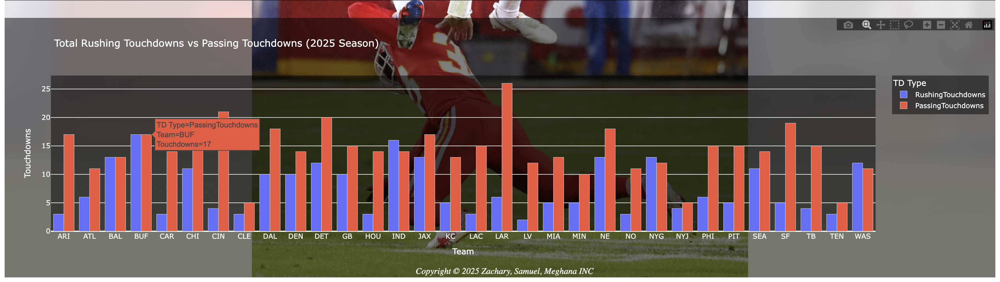

# 🏈 NFL 2025 Season Analysis Dashboard

An interactive dashboard built with Python and Dash analyzing NFL 2025 regular season statistics.
Created by Zachary Snow, Samuel Ainsah-Mensah, and Meghana — MGS 627 Final Project.

## Dashboard Preview




## Overview
This project fetches live NFL data from the SportsData.io API and visualizes key team and 
player statistics through an interactive web dashboard.

## Features
- 📊 **Key Performance Indicators** — Average PPG, highest scoring team, best turnover differential
- 🔍 **Team PPG Lookup** — Select any NFL team to see their points per game
- 📈 **Turnover Differential vs PPG** — Scatter plot with regression line
- 🏃 **Passing vs Rushing Yards** — Team-level offensive breakdown
- 🎯 **QB Passing Yards vs PPG** — Quarterback efficiency analysis
- 🏆 **Rushing TDs vs Passing TDs** — Touchdown breakdown by team

## Tech Stack
- **Python** — Core language
- **Dash & Plotly** — Interactive dashboard and visualizations
- **Pandas** — Data manipulation
- **Requests** — API calls
- **SportsData.io API** — NFL data source

## How to Run

### 1. Clone the repository
```bash
git clone https://github.com/zacharysnow/MGS_627_Final_Project.git
cd MGS_627_Final_Project
```

### 2. Install dependencies
```bash
pip install dash plotly pandas requests
```

### 3. Add your API key
Get a free API key from [SportsData.io](https://sportsdata.io) and replace in the code:
```python
API_KEY = 'YOUR_API_KEY_HERE'
```

### 4. Run the app
```bash
python "MGS 627 - Final Projects.py"
```
Then open your browser to `http://127.0.0.1:8050`

## Contributors
- Zachary Snow
- Samuel Ainsah-Mensah  
- Meghana

## License
MGS 627 — Spring 2025
